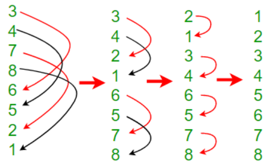

# Bitonic-sort
Bitonic Sort is a classic parallel algorithm for sorting. The number of comparisons done by Bitonic sort is more than popular sorting algorithms like Merge Sort (does $O(Nlog N)$ comparisons), but Bitonic sort is better for parallel implementation because we always compare elements in a predefined sequence and the sequence of comparison doesn’t depend on data. Therefore it is suitable for implementation in hardware and [**parallel processor array**](https://en.wikipedia.org/wiki/Massively_parallel_processor_array).

At first, lets talk about Bitonic Sequence then we will back to Bitonic Sorting.

## **Bitonic Sequence**

A sequence is called Bitonic if it is first increasing, then decreasing. In other words, an array arr[0..n-i] is Bitonic if there exists an index `i`, where **0<=i<=n-1** such that  

```
x0 <= x1 …..<= xi
and
x[i] >= x[i+1]….. >= x[n-1]
```

A sequence, sorted in increasing order is considered Bitonic with the decreasing part as empty. Similarly, decreasing order sequence is considered Bitonic with the increasing part as empty.

### How to sort a Bitonic Sequence

If I have given a  Bitonic sequence, how can I sort it ?

Bitonic sequence : 3 4 7 8 6 5 2 1

1. If sequence length is N, then take each pair of distance N/2 and sort them. So, we get (3, 4, 2, 1, 6, 5, 7, 8)
2. Split array into halves and repeat from step-1 for each half until N = 1.



### **How to form a Bitonic Sequence from a random input?**

Given sequence may not be Bitonic sequence always.

>Suppose, you are give two Bitonic sequence of length N and you want to make bitonic sequence of length $2 \times N$ from this two. How to do that ?
>
>We already know how to sort a bitonic sequence. So, sort increasingly the first sequence and sort decreasingly second sequence.
>

Now, consider lowest bitonic sequence is of length 2. To make, bitonic sequence of length 4, we need two bitonic sequence of length 2. Then, sort first one increasingly and last one decreasingly. Now, repeat this process until you convert whole array into bitonic sequence.
We can now convert any array into a bitonic sequence. Let's work through an example to practice this.

### **Example**
>Convert the following sequence to a bitonic sequence: 3, 7, 4, 8, 6, 2, 1, 5 

Initially given array can be considered as concatenation of multiple two length bitonic sequence.

$(3, 7) + (4, 8) + (6, 2) + (1, 5) = (3, 7, 4, 8, 6, 2, 1, 5 )$

Now, we can make two 4 length bitonic sequence from it.


Now I have (3, 7, 8, 4) and (2, 6, 5, 1) or two 4 length bitonic sequences. Now, try to make a 8 length bitonic sequence from them.


So, we get final Bitonic sequence from given array. Now, we can sort it using the algorithm already discussed above.


Time Complexity : $$O(n(\log n)^2)$$

## **Scope for Parallelization**

- **Predictable Comparisons**: Follows a fixed pattern of comparisons and swaps, ideal for parallel execution.
- **Divide-and-Conquer Structure**: Recursively divides the sequence into smaller, independently sortable bitonic sequences.
- **Parallel Bitonic Merging**: Comparisons within each level can run concurrently as they’re independent, enabling high parallel efficiency.
- **Efficient Use of Local Memory**: Subarrays can be stored in fast, local memory on GPUs, allowing quick access for parallel threads.

## **Implementation**
```c
__kernel void ParallelBitonic_Local(__global const data_t * in,
																		__global data_t * out,
																		__local data_t * aux)
{
  int i = get_local_id(0); // index in workgroup
  int wg = get_local_size(0); // workgroup size = block size, power of 2

  // Move IN, OUT to block start
  int offset = get_group_id(0) * wg;
  in += offset; out += offset;

  // Load block in AUX[WG]
  aux[i] = in[i];
  barrier(CLK_LOCAL_MEM_FENCE); // make sure AUX is entirely up to date

  // Loop on sorted sequence length
  for (int length=1;length<wg;length<<=1)
  {
    bool direction = ((i & (length<<1)) != 0); // direction of sort: 0=asc, 1=desc
    // Loop on comparison distance (between keys)
    for (int inc=length;inc>0;inc>>=1)
    {
      int j = i ^ inc; // sibling to compare
      data_t iData = aux[i];
      uint iKey = getKey(iData);
      data_t jData = aux[j];
      uint jKey = getKey(jData);
      bool smaller = (jKey < iKey) || ( jKey == iKey && j < i );
      bool swap = smaller ^ (j < i) ^ direction;
      barrier(CLK_LOCAL_MEM_FENCE);
      aux[i] = (swap)?jData:iData;
      barrier(CLK_LOCAL_MEM_FENCE);
    }
  }

  // Write output
  out[i] = aux[i];
}
```
